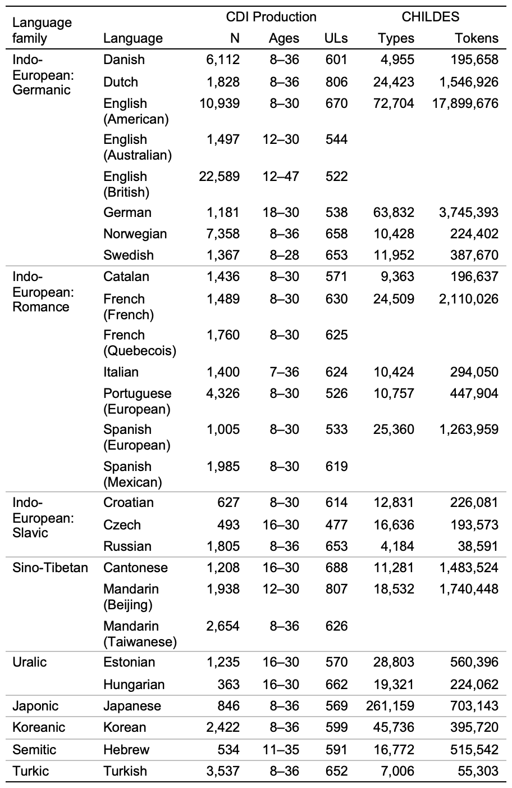
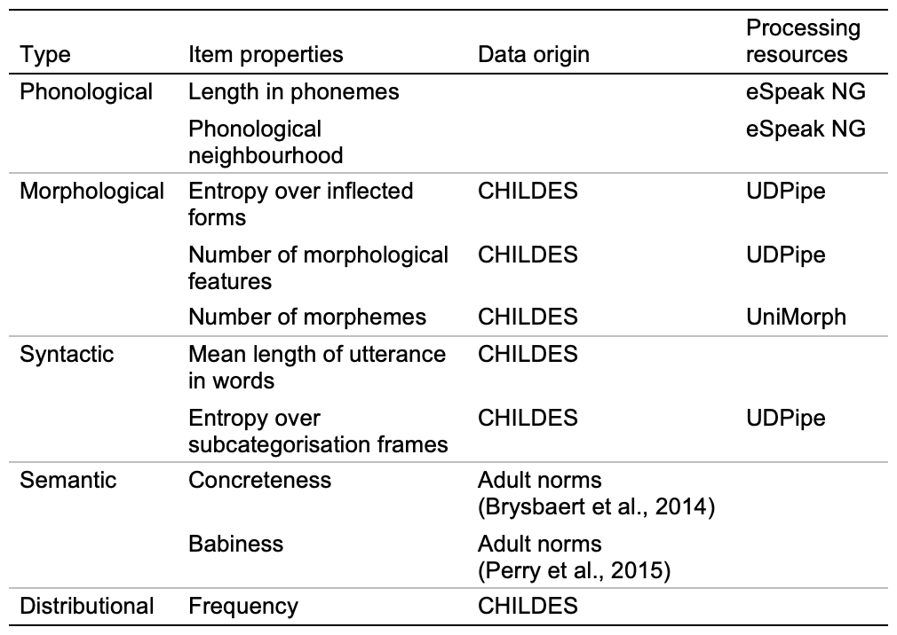

```{r global_options, include=FALSE}
knitr::opts_chunk$set(fig.width=3, fig.height=3, fig.crop = F, 
                      fig.pos = "tb", fig.path='figs/',
                      echo=F, warning=F, cache=F, 
                      message=F, sanitize = T)
```

```{r, libraries}
library(tidyverse)
library(here)
library(glue)
library(broom.mixed)
# library(gplots)
library(ggrepel)
library(papaja)
# library(flextable)
source("plot-helper.R")
source("coefs.R")
options(scipen = 2, digits = 2)
set.seed(42)
```

# Introduction

Why are some words learnt earlier than others? 
Despite the variation in the structure of different languages, children demonstrate remarkably similar early lexical development across languages, with highly overlapping first words [@frankVariabilityConsistencyEarly2021; @tardifBabyFirst102008], and similar emergence of lexical categories [@caselliCrosslinguisticStudyEarly1995]. 
The order of lexical development can thus be used as a tool to understand the commonalities and differences in the factors that predict word learning across languages and lexical categories. 

Such questions have led to a productive line of inquiry, with previous research demonstrating that, in English, words learnt earlier tend to be more frequent [@goodmanDoesFrequencyCount2008], be more iconic [@perryIconicityEnglishSpanish2015], and appear in shorter utterances [@swingleyQuantitativeLinguisticPredictors2018]. 
The conclusions of these studies, however, were limited in generalisability as they considered different sets of predictors, and mostly focused only on English-learning children. 
To have a more comprehensive understanding of early language learning, it is important to capture two dimensions of variability: across languages, and across levels of linguistic representation (e.g., phonological, morphological, syntactic, and semantic). 
These dimensions jointly provide information about how different sources of information may be differentially relevant across languages of different structures.

One study that has adopted this approach comes from @braginskyConsistencyVariabilityChildren2019, who conducted a larger scale cross-linguistic study across 10 languages, using a larger set of predictors to determine their independent contributions to word learning [see also @frankVariabilityConsistencyEarly2021]. 
Overall, they found strong consistent effects for predictors such as frequency and concreteness, but little to no effect of predictors such as valence. 
Nonetheless, there are two crucial limitations to their set of analyses. First, among the predictors they considered, most were distributional (unigram frequency, frequency as sole or last word in utterance) or semantic (concreteness, babiness, valence, arousal), with only one phonological predictor (length in phonemes) and one syntactic predictor (mean length of utterance). 
Although there are cross-linguistic and cultural differences in word distributions in naturalistic speech, frequencies are remarkably consistent, especially for fundamental vocabulary [@caludeHowWeUse2011], and semantic representations also tend to exhibit similar organisations cross-linguistically, at least within semantic domains [@lewisLocalSimilarityGlobal2023]. 
It is thus important to consider the full range of levels of linguistic representation, particularly the levels which are more likely to exhibit larger variation across languages, namely morphological and syntactic factors. 

Second, of the 10 languages examined by @braginskyConsistencyVariabilityChildren2019, all but one (Turkish) were Indo-European.
As such, it is possible that some of the consistency that they observed was in fact due to structural similarities among Indo-European languages, as opposed to underlying patterns in language learning across languages regardless of language family.
To have a more generalisable understanding of the factors driving early word learning, it is imperative to study a more diverse set of languages, representing more language families [see @kiddHowDiverseChild2022]. 

Hence, the present study aims to capture a more comprehensive view of early word learning by including a broad set of predictors encompassing phonological, morphological, syntactic, and semantic levels of representation, as well as a large set of languages with particular emphasis on non-Indo-European languages. 
We also examine the role of lexical categories, given the theoretical predictions that different lexical categories may be sensitive to different predictors. 
We aim to answer two key research questions: (1) whether predictors are consistent across different languages, and (2) whether predictors are consistent across different lexical categories.
Together, these directions will improve our characterisation of the consistency and variation in early word learning across languages. 

# Method

## Acquisition data

To study word learning in young children, we use data collected via MacArthur–Bates Communicative Development Inventories (CDIs), which are parent-report vocabulary checklists [@marchmanMacArthurBatesCommunicativeDevelopment2023]. 
CDIs are easy to administer and have been adapted into dozens of different languages, with demonstrated reliability and validity as a measure of language ability [@fensonMacArthurBatesCommunicativeDevelopment2007; @mayorStatisticalEstimateInfant2011], making them an effective method for capturing children’s vocabularies in different contexts. 

We used vocabulary data from Wordbank [@frankWordbankOpenRepository2017], an open repository of CDI data. 
These data included item-level data for each child, along with associated demographic information such as the child’s age. 
We extracted productive vocabulary information from all forms, and expressive vocabulary information from Words & Gestures forms. 
Children with reported language exposure to more than one language were excluded, and for children with longitudinal data, only the first administration was used. 
We included data from all languages for which all necessary resources were available (see the Predictor data section for resources used), amounting to `r descriptives |> pull('CDI Production_N') |> sum()` children across 27 languages and dialects. 
An overview of the data used is shown in Figure \ref{fig:descriptives}.

```{r descriptives}
#| fig.env = "figure", 
#| fig.pos = "ht", 
#| fig.align = 'center', 
#| out.width = 230,
#| set.cap.width = T, 
#| num.cols.cap = 1, 
#| fig.cap = "Descriptive statistics for data from Wordbank and CHILDES. N indicates number of children. ULs indicates number of unilemmas (see text)."

# flextable(descriptives) |> 
#   merge_v(j = ~ `Language family` + CHILDES_Types + CHILDES_Tokens) |> 
#   separate_header() |> 
#   valign(valign = "top")


```

To conduct comparisons across languages, we mapped items to "universal lemmas" or "unilemmas", which are approximate cross-linguistic conceptual abstractions. 
For example, the items "chat" (FRA) and "gato" (SPA) map to the same unilemma, \textsc{cat}. 
These unilemmas were first constructed from glosses provided by original dataset contributors, then verified by native or proficient speakers, and manually cleaned and consolidated to improve overall consistency; more information about unilemma construction can be found on Github [LINK REDACTED]. 
Note that some items do not have corresponding unilemmas (e.g., language-specific items that were not relevant cross-linguistically); these items were dropped for analysis.

From these data, we derived ages of acquisition (AoAs) by fitting Bayesian logistic regressions for each item, predicting word knowledge (produces vs does not produce; understands vs does not understand) from age. 
We used weakly informative priors of $\mathcal{N}(0, 2.5)$ for the intercept and $\mathcal{N}(0.3, 0.01)$ for the slopes. 
Then, the AoA is the earliest age at which 50% of children are expected to know the word, and can be calculated as the negative of the intercept divided by the slope from fitted models [see @braginskyUhohTomorrowPredicting2016].

## Predictors of age of acquisition

For each language, we used corpora of child-directed speech from CHILDES [@macwhinneyCHILDESProjectTools2000] to calculate distributional information as well as mean length of utterance in words (MLU-w).[^1]
We also used these corpora in conjunction with morphological segmentation information from UniMorph [@batsurenMorphyNetLargeMultilingual2021; @sylak-glassmanCompositionUseUniversal2016] and morphosyntactic parsing from UDPipe [@strakaUDPipePrototypeCoNLL2018] to calculate morphosyntactic predictors. 
In addition, we used previously collected adult psycholinguistic norms for the semantic predictors (detailed below), and eSpeak NG [@vitolinsESpeakNG2022] to obtain phonological representations for the calculation of phonological properties. 
An overview of the data and resources used for each item property is shown in Figure \ref{fig:sources}.

[^1]: Note that some of the languages (Hebrew and Russian) had CHILDES corpora that were transcribed in transliterated form instead of the original script; we used ad-hoc custom reverse transliteration scripts to enable matching to other resources.

```{r sources}
#| fig.env = "figure", 
#| fig.pos = "ht", 
#| fig.align = 'center', 
#| out.width = 240,
#| set.cap.width = T, 
#| num.cols.cap = 1, 
#| fig.cap = "Item properties used, along with the data origins and resources used to derive item property values."


```

**Phonological properties.** 
For each item in each language, we generated phonological representations for all possible realisations of the item (e.g., "cat", "cats") with eSpeak NG. 
These were directly used to calculate the mean length in phonemes, and to measure the size of the phonological neighbourhood, which was the number of other items that differed from the target item by at most a Levenshtein distance of 2. 

**Morphological properties.**
To capture the morphological properties of words, we considered both paradigmatic and syntagmatic complexity. 
Paradigmatic complexity refers to the possible alternative realisations of a particular lemma (e.g., "run", "runs", "running"), whereas syntagmatic complexity refers to sequential relationships within a particular realisation (e.g., sequences of morphemes).

We used two measures of morphological paradigmatic complexity, namely entropy over inflected forms and number of morphological features, both of which involved morphological parsing from UDPipe. 
For each item, we found all tokens in CHILDES which had the same lemma as the item, and calculated the Shannon entropy over the inflected forms [@coltekinWhatComplexityMeasures2023]. 
The parsing also output morphological features in the Universal Dependencies format [@nivreUniversalDependencies2017], and we calculated the mean number of morphological features for each item as an approximation of the size of the inflectional paradigm.

We also included one measure of morphological syntagmatic complexity, namely mean number of morphemes; this made use of morphological segmentation information from UniMorph. 

**Syntactic properties.** 
For each item, we calculated the MLU-w for utterances in which the item appeared using CHILDES corpora, as a proxy for the syntactic complexity of the item. 
We also used UDPipe to parse the dependency structure of utterances, extracting the core and oblique verbal dependents (objects, clausal complements, and obliques), which served as a proxy for subcategorisation frames. 
We then calculated the entropy over subcategorisation frames [@sharpeAutomaticAccessVerb2019].

**Semantic properties.** 
We used previously collected adult norms for concreteness [@brysbaertConcretenessRatings402014] and babiness [@perryIconicityEnglishSpanish2015] as our semantic predictors.

**Distributional properties.** 
We used CHILDES to calculate item unigram frequencies, which were Laplace smoothed and log-transformed.

**Lexical categories.** 
Lexical categories were determined on the basis of the conceptual categories presented on the CDIs (e.g., "Animals", "Action words", "Descriptive words"). We used the categories "nouns" (for common nouns), "predicates" (for verbs, adjectives, and adverbs), and "function words" (for closed class words); all other items were classified as "other".

## Predictor processing

**Residualisation.** 
Some of the item properties were a priori correlated with one another. 
For example, shorter words tend to have larger phonological neighbourhoods, and words with more morphological features are likely to exhibit greater entropy over inflected forms. 
As such, we conducted residualisation for phonological, morphological, and syntactic properties. 
For each property type, we residualised the first property (e.g, length in phonemes) out of all other properties (e.g., phonological neighbourhood), such that the coefficients of the other properties would reflect their effects over and above any variance explained by the first property. 

**Imputation.** 
Some of the item properties contained missing data depending on resource availability. 
We filled in missing values for each language by iteratively imputing these values based on a linear regression fitting that property from all other properties.

**Normalisation.** 
Finally, we centred and scaled all properties to allow for direct comparison of standardised regression coefficients.

**Collinearity.** 
One possible concern for comparing coefficients across languages is multicollinearity among predictor values. 
We calculated variance inflation factors (VIFs) on models including all predictors except for lexical categories (since models with interaction effects are known to have inflated VIFs). 
The VIFs for each predictor in each language was $<$ `r round(max(vifs$vif)+0.05, 1)`, indicating low multicollinearity among predictors.

```{r big_plot}
#| fig.env = "figure*", 
#| fig.pos = "ht", 
#| fig.align = 'center', 
#| fig.width = 12, 
#| fig.height = 5.25, 
#| out.width = 500,
#| set.cap.width = T, 
#| num.cols.cap = 2, 
#| fig.cap = "Maximum a posteriori estimates of coefficients predicting age of acquisition across all languages. Black vertical bars indicate estimate medians across all languages. Significance indicates whether the credible interval includes zero."

ggplot(plot_coefs, 
       aes(x = estimate, y = term)) +
  facet_grid(term_cat ~ ., scales = "free", space = "free") +
  geom_point(aes(shape = signif, color = language),  alpha = 0.7) +
  scale_shape_manual(values = c(21, 16)) +
  stat_summary(geom = "crossbar", fun = median, fun.min = median,
               fun.max = median, fatten = 2, width = 0.5) +
  geom_vline(xintercept = 0, color = "grey", linetype = "dotted") +
  labs(x = "Coefficient estimate", y = "", 
       shape = "Significance", color = "Language") +
  theme_mikabr() +
  coord_cartesian(xlim = c(-2.5, 2.5))
```

## Analysis

We fit Bayesian linear models for each language, predicting the AoA of each item from all item properties and their interactions with lexical category. 
The Bayesian approach allowed us to incorporate information from prior research, and also provided implicit regularisation for coefficients that may be underdetermined due to data sparsity.
We used conservative informative priors based on coefficient values from @braginskyUhohTomorrowPredicting2016, which broadly fell in the range $(-2, 2)$; thus, we used a non-standardised $t$ distribution, $t(3, 0, 2)$, as priors for coefficients. 
The resultant standardised coefficients for each item property would reflect its independent contribution to the AoA of the item, and interactions with lexical categories would reflect how this contribution varies across categories.

All code for data processing and analysis can be found on Github [LINK REDACTED].

# Results

To display model results concisely, we plotted the maximum a posteriori estimates for each predictor from the model for each language, and describe median values below. 
The main effects from all languages are shown in Figure \ref{fig:big_plot}. 

Model results demonstrated strong and consistent effects of frequency ($\bar{b}$ = `r plot_coefs |> filter(term == "Frequency") |> pull(estimate) |> median()`), concreteness ($\bar{b}$ = `r plot_coefs |> filter(term == "Concreteness") |> pull(estimate) |> median()`), and babiness ($\bar{b}$ = `r plot_coefs |> filter(term == "Babiness") |> pull(estimate) |> median()`), such that words which were more frequent, concrete, and associated with babies were learnt earlier. 
For phonological predictors, longer words as measured in phonemes were learnt later ($\bar{b}$ = `r plot_coefs |> filter(term == "Length in phonemes") |> pull(estimate) |> median()`), but there was no reliable effect of phonological neighbourhood ($\bar{b}$ = `r plot_coefs |> filter(term == "Phon neighbours") |> pull(estimate) |> median()`). 
For morphological predictors, the number of morphological features ($\bar{b}$ = `r plot_coefs |> filter(term == "N features") |> pull(estimate) |> median()`), entropy over inflected forms ($\bar{b}$ = `r plot_coefs |> filter(term == "Form entropy") |> pull(estimate) |> median()`), and number of morphemes ($\bar{b}$ = `r plot_coefs |> filter(term == "N morphemes") |> pull(estimate) |> median()`) all did not have reliable effects. 
For syntactic predictors, entropy over subcategorisation frames did not have a reliable effect ($\bar{b}$ = `r plot_coefs |> filter(term == "Subcat entropy") |> pull(estimate) |> median()`), while words that had a greater MLU-w were learnt later ($\bar{b}$ = `r plot_coefs |> filter(term == "MLU-w") |> pull(estimate) |> median()`).

## Lexical categories

```{r lc_plot}
#| fig.env = "figure*", 
#| fig.pos = "ht", 
#| fig.align = 'center', 
#| fig.width = 12, 
#| fig.height = 5.5,
#| out.width = 500, 
#| set.cap.width = T, 
#| num.cols.cap = 2, 
#| fig.cap = "Maximum a posteriori estimates of coefficients predicting age of acquisition across all languages, by lexical category. Black vertical bars indicate estimate medians across all languages."

ggplot(lc_plot,
       aes(x = estimate, y = term)) +
  facet_grid(term_cat ~ lexical_category, scales = "free", space = "free") +
  geom_point(aes(color = language),  alpha = 0.7) +
  stat_summary(geom = "crossbar", fun = median, fun.min = median,
               fun.max = median, fatten = 2, width = 0.5) +
  geom_vline(xintercept = 0, color = "grey", linetype = "dotted") +
  labs(x = "Coefficient estimate", y = "") +
  theme_mikabr() +
  theme(legend.position = "none") +
  coord_cartesian(xlim = c(-3.5, 3.5))
```

Estimates of predictor coefficients for different lexical categories are shown in Figure \ref{fig:lc_plot}. 
Effects were mostly consistent across lexical categories, with a few notable deviations. 
The effect of babiness was attenuated for function words ($\bar{b}$ = `r lc_plot |> filter(term == "Babiness", lexical_category == "Function words") |> pull(estimate) |> median()`), and the effect of length in phonemes was attenuated for predicates ($\bar{b}$ = `r lc_plot |> filter(term == "Length in phonemes", lexical_category == "Predicates") |> pull(estimate) |> median()`). 
On the other hand, the effect of MLU-w was enhanced for function words ($\bar{b}$ = `r lc_plot |> filter(term == "MLU-w", lexical_category == "Predicates") |> pull(estimate) |> median()`).

## Correlations

```{r correlations}
#| fig.env = "figure", 
#| fig.pos = "ht", 
#| fig.align = 'center', 
#| fig.width = 6, 
#| fig.height = 5.5, 
#| out.width = 240,
#| set.cap.width = T, 
#| num.cols.cap = 1, 
#| fig.cap = "Correlations of main effect coefficients across languages. Filled circles indicate correlations with all other languages. Empty circles indicate correlations with other languages within the same language family. Shaded areas represent the bootstrapped randomised baseline. All ranges indicate 95% confidence intervals. Dotted line indicates mean correlation. Colours represent language families."

ggplot(dd_cor_all, aes(y = language, col = language_family)) +
  geom_vline(xintercept = mean(dd_cor_all$estimate_gen),
             color = "grey", linetype = "dotted") +
  geom_pointrange(aes(x = estimate_gen, xmin = ci.lb_gen, xmax = ci.ub_gen)) +
  geom_pointrange(aes(x = estimate_fam, xmin = ci.lb_fam, xmax = ci.ub_fam),
                  shape = 21) +
  geom_boxplot(aes(xlower = ci.lb_rand, xupper = ci.ub_rand, xmiddle = estimate_rand,
                   xmin = ci.lb_rand, xmax = ci.ub_rand,
                   fill = language_family),
               stat = "identity", col = "#FFFFFF00") +
  scale_colour_manual(values = FAM_SCALE) +
  scale_fill_manual(values = FAM_SCALE) +
  theme_mikabr() +
  theme(legend.position = "none") +
  labs(x = "Correlation",
       y = "Language")
```

To understand the consistency and variability of predictors across languages, we calculated the correlations between the coefficients of the main effects for each language with all other languages, and with other languages within its language family (for language families with $\ge 2$ included languages), as shown in Figure \ref{fig:correlations}. 
The average correlation across languages was relatively high ($\bar{r}$ = `r dd_cor_gen |> pull(estimate) |> mean()`).
Mean correlations within language families were broadly numerically greater than those across language families, indicating greater consistency within language families, except for families in which particular languages had more idiosyncratic predictor coefficients (English (British), Swedish, and Russian). 
We also calculated a bootstrapped randomised baseline by permuting the predictor labels for coefficients within each language and recalculating correlations with other languages, representing correlations that would be expected by chance. 
This baseline was consistently close to 0, and consistently smaller than observed correlations.

## Exploratory analysis: Morphological complexity

As an exploratory analysis, we sought to understand the variation in the effect sizes of morphosyntactic predictors as a function of the morphological complexity of the language, which may affect the importance or informativeness of other morphosyntactic factors as cues for word learning. 
Hence, for each combination of morphosyntactic factor and lexical category, we conducted a linear regression with morphosyntactic factor coefficient as the outcome variable and morphological complexity as the predictor variable. 
We estimated morphological complexity using the method from @bentzComparisonMorphologicalComplexity2016, who used a composite index from 28 features of the World Atlas of Linguistic Structures [@dryerWorldAtlasLanguage2013], ranging from 0 (least morphologically complex) to 1 (most morphologically complex). 

```{r mlu_pred}
#| fig.env = "figure", 
#| fig.pos = "ht", 
#| fig.align = 'center', 
#| fig.width = 6, 
#| fig.height = 5.5, 
#| out.width = 240,
#| set.cap.width = T, 
#| num.cols.cap = 1, 
#| fig.cap = "Coefficient of MLU-w for predicates against estimated morphological complexity. Shaded area indicates standard error."

ggplot(mlu_pred, aes(x = morph_complexity, y = estimate)) +
  geom_point(aes(col = language)) + 
  geom_smooth(method = "lm", col = "black") +
  geom_hline(yintercept = 0, color = "grey", lty = "dotted") +
  geom_label_repel(aes(label = iso_unique, col = language), size = 3.5) +
  labs(x = "Estimated morphological complexity", 
       y = "Coefficient estimate",
       col = "Language") +
  theme_mikabr() +
  theme(legend.position = "none")
```

Only one model demonstrated a significant main effect of morphological complexity, which was the model with MLU-w for predicates as the outcome variable, as shown in Figure \ref{fig:mlu_pred}. 
The coefficient of the effect of morphological complexity was negative ($b$ = `r mc_vals |> filter(ms_term == "MLU-w", lexical_category == "Predicates", term == "morph_complexity") |> pull(estimate)`, $p$ = `r mc_vals |> filter(ms_term == "MLU-w", lexical_category == "Predicates", term == "morph_complexity") |> pull(p.value)`), suggesting that languages with greater morphological complexity had a smaller effect of MLU-w for the AoA of predicates.

# Discussion

What factors affect early word learning in children across languages?
By examining the predictors of AoA across different languages, we found that words with higher frequency, concreteness, and babiness were learnt earlier, whereas words with greater length in phonemes and MLU-w were learnt later. 
We found that these effects were generally consistent across typologically diverse languages, suggesting that early word learning broadly taps on similar sources of linguistic information despite disparities in the realisations of such information across languages [see @braginskyConsistencyVariabilityChildren2019]. 

In contrast, there was little evidence of any effect of morphosyntactic predictors. 
This finding is surprising, given the diversity in morphosyntax across the languages included in our study. 
One possible explanation for the lack of a reliable effect is the operationalisation of our metrics. 
When completing the CDI, caregivers may indicate that their child is able to say a word even if the specific produced form is reduced or otherwise idiosyncratic, and thus the child need not have a complete grasp of the word's inflectional paradigm.
As such, we adopted metrics that were appropriate at the lemma level (e.g., information about the complexity of lemma paradigms). 
Morphosyntactic predictors may not matter for the age of first production of an item, but may be more crucial for learning other aspects of morphosyntax, particularly in deploying appropriately inflected forms.

We also did not find an effect of phonological neighbourhood size, which contrasts with previous work suggesting that words with larger phonological neighbourhoods were more likely to be learnt [@fourtassiGrowthChildrenSemantic2020; @jonesChildrenReallyAcquire2019]. 
In particular, @fourtassiGrowthChildrenSemantic2020 used a relatively similar method of calculation to the present study (considering only CDI words as potential neighbours and controlling for frequency), but still found an effect of phonological neighbourhood. 
The difference in results may be due to the fact that they restricted their analyses to CDI nouns, whereas we also included predicates and function words in our reference corpora.
Further research is necessary to determine whether lexical category-specific phonological networks may be more relevant for early word learning.

Our results also demonstrated broad consistency across lexical categories, with some variation for particular predictors. 
This variation supports the hypothesis that words from different lexical categories may be learnt in different ways, such that different word properties may contribute to differing extents. 
For example, semantic factors (such as babiness) may be less important for function words, whereas syntactic complexity (as measured by MLU-w) may be more important, and word length may not be the bottleneck for acquiring predicates. 
These results align with the predictions made by other theories of early language acquisition. 
Notably, syntactic bootstrapping theory [@gleitmanStructuralSourcesVerb1990] suggests that syntactic information may be more crucial for acquiring the meanings of function words, because young children acquiring function words have to infer their meaning based on their role in sentences, and that inference is easier for shorter sentences.
Comparatively, noun semantics can be learnt more easily from direct cross-situational mapping [@monaghanGavagaiGavagaiDoes2015]. 

Indeed, the differing roles of various predictors across lexical categories is also demonstrated by the relationship between morphological complexity and the effect of MLU-w, specifically for predicates (but not nouns or function words). 
This finding provides some support for the competition model [@batesFunctionalistApproachesGrammar1982], which suggests that differential cue availability and reliability across languages may lead to differences in the AoA of different linguistic structures. 
For languages with greater morphological complexity, the reliability of morphological markers may lead to a lessened effect of syntactic complexity, and vice versa, suggesting a trade-off between the two dimensions of complexity [see @bentzComplexityTradeoffsEquicomplexity2022; but cf. @benitez-burracoAbsenceTradeoffMorphological2024]. 
It is important to emphasise that this analysis is exploratory in nature, and the results should be interpreted with caution, especially because of the small number of data points.

The current study represents an attempt to understand the process of word learning across a large range of languages, so as to better characterise the role of linguistic diversity in early language learning. 
In particular, we expanded the range of languages under consideration, using data from 27 languages and varieties, of which 10 (i.e., more than a third) were non-Indo-European. 
Nonetheless, there remained an Indo-European bias, and certain language families were also underrepresented, especially language families across Africa and Oceania; much more research in those languages is necessary for a truly comprehensive view of early word learning.

Additionally, even for the languages included in our study, there was variation in the amount and quality of coverage for the different resources used. 
For example, some languages have more UniMorph data on verbs than other lexical categories, which may have resulted in biassed predictor values. 
The consistency in observed predictor values suggests that such a potential bias was not very large in magnitude, but it remains crucial to increase resource availability in understudied languages to permit more accurate research.

Nonetheless, the current work presents a case for the use of a diverse range of language samples to study the consistency and variability of early language learning across languages and across levels of representation. 
It also provides an open, extensible pipeline that easily allows for the addition of other languages and predictors, enabling a range of applications both in cognitive science and in evaluating language models [e.g., @changWordAcquisitionNeural2022]
Additionally, it is worth highlighting that this research was only made possible through the availability of multiple open data and open science resources, emphasising the importance of open science practices. 
Continued advancements in data collection and sharing from a greater breadth of languages will certainly help to further our understanding of language acquisition in young children.

# References 

\setlength{\parindent}{-0.1in} 
\setlength{\leftskip}{0.125in}
\noindent
